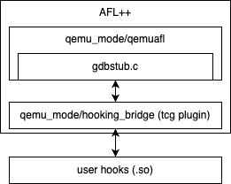
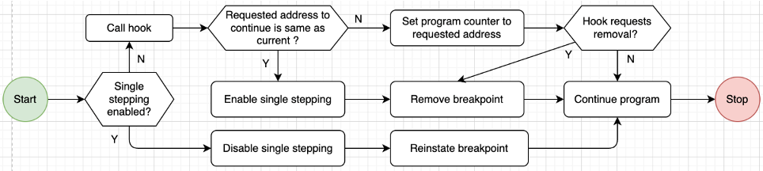

# Code walkthrough
*User documentation is provided in README.md under qemu_mode/hooking_bridge*.

## Runtime operation


The hooking bridge (`hooking_bridge`) is basically a TCG plugin that communicates with the GDB server (`gdbstub.c`) while installing user supplied hooks from a shared library. This architecture provides strong decoupling from actual QEMU/qemuafl code.

The workflow in `qemu_mode/hooking_bridge/src` proceeds in this order
1. At startup (in `patching.c:patch_init`),
    1. The *hooking_bridge* calls a `configure()` function that must be defined in the user hooks library. The specification for this function is provided in `../README.md`. Essentially, it outputs the list of hook function names, where to place them (*hfs:=[<hf,loc>]*), a numerical identifier for the instruction pointer for the target architecture *ip* and the entry point for the target software *en*.
    2. Registers a signal callback `handle_signal_callback` by calling a newly introduced `set_signal_callback` in `gdbstub.c`.
2.  When *en* is hit (`patching.c:patch_block_trans_cb`),
    1. We first initiate the GDB server (`gdb_accept_init(-1)`) by passing a dummy file descriptor -1. This does not hamper the protocol at runtime as will be seen later.
    2. We next register breakpoints for each *hf* in *hfs* at the requested *loc*, `gdb_breakpoint_insert(0,config->hooks[i],1);` where `config->hooks[i]` is the *loc*.
3. At runtime, upon hitting the registered breakpoints, the GDB stub transfers the call to `gdb_handlesig`.
    1. At the onset of `gdb_handlesig` 
        * We call the `handle_signal_callback` if it has been installed and the current signal is a trap, i.e. a breakpoint. Note that this means that all breakpoints in this mode, i.e. when the `hooking_bridge` is being used, are processed purely for user hooking purpose. That is, we cannot use QEMU native GDB (-g) debugging in this mode. Obviously, this is not a problem for fuzzing use cases but if qemuafl is being used standalone, it cannot debug if hooks are being used. We do not consider it as a limitation because qemuafl and the hooking_bridge functionality are typically geared towards fuzzing use cases. 
        * If the signal is not a trap, but the signal handler is still installed, we return the signal number indicating that the default handling needs to be ensued. For example, for a *stack smashing* enforced abort, it can be returned to the OS/fuzzer.
    2.  Within `handle_signal_callback` we follow the following process flow
    
        1. We enable single stepping if breakpoints are not removed, for example when fuzzing a loop in a server application. If single stepping is enabled (`if (single_stepped){...}`), we disable it first so no more single step breakpoints will hit after, and reinstate the breakpoint.
        2. If single stepping is not enabled, we first call the hook by forming its name using the current instruction pointer and using `dlopen`. This avoids performing a lookup directly. *Currently, it does not show any significant drop in fuzzing performance, so we believe it may be the way to go. We may have to compare this method with a lookup table/interval tree approach later. Also, this make the hook function names rigid as described in ../README.md*
        3. Post hooking, 
            1. We check if the asked return address is the same as current address. If so, we enable single stepping (`cpu_single_step`), remove the breakpoint `gdb_breakpoint_remove` (so it is not called again at the same *loc*) and continue. Single stepping stops it again at the next instruction where we disable it and remove the breakpoint.
            2. If the return address is not the same as the current instruction pointer, we set `gdb_set_cpu_pc` to the requested return address.
            3. If the user has asked to remove the hook (`remove_bp`), for example if the hooking location will not be called again, we do so. Either ways, we `gdb_continue`. 

## Memory R/W API
We provide wrappers to the following `gdbstub.c` defined functions -- 
```C
-	static int gdb_read_register(CPUState *cpu, GByteArray *buf, int reg)
-	static int gdb_write_register(CPUState *cpu, uint8_t *mem_buf, int reg)
-	static inline int target_memory_rw_debug(CPUState *cpu, target_ulong addr, uint8_t *buf, int len, bool is_write)
```
where we remove the static and inline modifiers.
The wrappers that the user can call in their hooks are
```C
int r_mem(unsigned long long addr, unsigned long long len, void *dest)
int w_mem(unsigned long long addr, unsigned long long len, void *src)
int r_reg(unsigned char reg, void *dest)
int w_reg(unsigned char reg, char *src)
```
## Building support
We have added a small section in `build_qemu_support.sh`
```bash 
#### Hooking support
...
#### End of hooking support
```
that compiles the tools using options described in ../README.md

## Testing
At this point, we have tested on a locally developed demo application in different settings, with and without being inside infinite loops.
If required, we can test it on some pre-configured dataset it that is required.